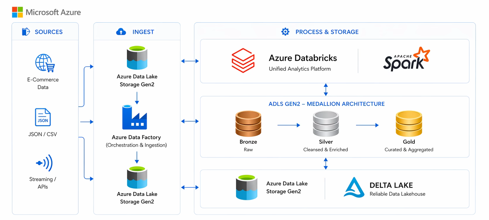

# ecom-data-pipeline

This personal portfolio project simulates a C2C fashion marketplace analytics pipeline built with Azure Data Factory and Azure Databricks using Unity Catalog and a Bronze/Silver/Gold medallion architecture. The pipeline answers a country-level marketplace question: which markets show stronger buyer engagement, seller performance, app adoption, and product activity after raw user, buyer, seller, and country files are standardized and modeled into one Gold reporting table.



## Architecture

```text
Raw C2C marketplace CSV exports
        |
        v
data/landing-zone-1/
Original source files and chunked user batches
        |
        v
Azure Data Factory copy activity
Reads Landing Zone 1, standardizes file names/folders, writes Landing Zone 2
        |
        v
data/landing-zone-2/
One standardized raw file per entity
        |
        v
Databricks Unity Catalog external volume
ecom_db_bharath.raw.raw_files
        |
        v
Bronze Delta tables
ecom_db_bharath.bronze.users
ecom_db_bharath.bronze.buyers
ecom_db_bharath.bronze.sellers
ecom_db_bharath.bronze.countries
        |
        v
Silver Delta tables
cleaned, casted, standardized, deduplicated, and enriched
        |
        v
Gold Delta table
ecom_db_bharath.gold.ecom_one_big_table
        |
        v
BI tool / Databricks SQL
```

## Why Unity Catalog Instead Of DBFS Mounts / Hive Metastore

- Storage access is governed through a Unity Catalog external volume (`ecom_db_bharath.raw.raw_files`) instead of notebook-level DBFS mount paths.
- Tables are addressed with three-part names such as `ecom_db_bharath.bronze.users`, which makes the Bronze, Silver, and Gold layers easier to discover and manage.
- Managed Delta tables are written with `saveAsTable()`, so downstream notebooks read table names rather than hard-coded storage folders.

## Pipeline Stages

### 1. ADF Landing Zones

`data/landing-zone-1/` represents the raw source files as received before ADF standardization. The users feed arrives as ten incremental chunks, not one file. The first five user chunks have 24 columns and include app/login fields: `hasAnyApp`, `hasAndroidApp`, `hasIosApp`, and `daysSinceLastLogin`. The last five user chunks have 21 columns, omit those four fields, and include `websiteLongevity` instead. This schema drift is why the pipeline separates raw landing from the standardized Databricks ingestion layer.

ADF sits between the two landing zones. It reads the raw files from Landing Zone 1, standardizes the batches into consistent entity folders, and writes the output to Landing Zone 2. `data/landing-zone-2/` contains one consistently named file per entity: users, buyers, sellers, and countries. The Databricks Bronze notebook is written to read these entity folders from the Unity Catalog external volume path `/Volumes/ecom_db_bharath/raw/raw_files`.

### 2. Bronze Layer

Notebook: `notebooks/01_Bronze_Layer_Unity_Catalog.py`

The Bronze notebook creates the catalog and schemas `raw`, `bronze`, `silver`, and `gold` under `ecom_db_bharath`. It creates the external volume `ecom_db_bharath.raw.raw_files` at `abfss://landing-zone-2@ecomadlsbharath.dfs.core.windows.net/raw_files/`, lists the raw volume, reads four parquet folders (`users-raw-2`, `buyers-raw-2`, `sellers-raw-2`, `countries-raw-2`), and writes them as managed Delta tables:

- `ecom_db_bharath.bronze.users`
- `ecom_db_bharath.bronze.buyers`
- `ecom_db_bharath.bronze.sellers`
- `ecom_db_bharath.bronze.countries`

The Bronze notebook does not apply business transformations. It validates that the tables exist with `SHOW TABLES`, previews `bronze.users`, and runs row-count checks for all four Bronze tables.

### 3. Silver Layer

Notebook: `notebooks/02_Silver_Layer_Unity_Catalog.py`

The Silver notebook reads the four Bronze tables and applies table-specific cleaning, type casting, deduplication, and derived fields.

Users transformations:

- Normalizes `countryCode` with `upper(trim(countryCode))`.
- Creates `language_full` from `language`: `en` -> English, `fr` -> French, `de` -> German, `es` -> Spanish, `it` -> Italian, otherwise Other.
- Standardizes `gender`: values starting with `M` become Male, values starting with `F` become Female, all others become Other.
- Creates `civilitytitle_clean` by lowercasing `civilityTitle`, replacing `mme|mrs|ms` with `ms`, then applying `initcap`.
- Casts `daysSinceLastLogin` to integer and fills nulls with `0`.
- Creates `years_since_last_login` as `round(daysSinceLastLogin / 365, 2)`.
- Creates `account_age_years` as `round(seniority / 365, 2)`.
- Creates `account_age_group`: New if `< 1`, Intermediate if `>= 1 and < 3`, otherwise Experienced.
- Adds `current_year` using `year(current_date())`.
- Creates `user_descriptor` by concatenating `gender`, `countryCode`, the first three characters of `civilitytitle_clean`, and `language_full`.
- Creates `flag_long_title` when `length(civilityTitle) > 10`.
- Casts `hasAnyApp`, `hasAndroidApp`, `hasIosApp`, and `hasProfilePicture` to boolean.
- Casts `socialNbFollowers`, `socialNbFollows`, `socialProductsLiked`, `productsListed`, `productsSold`, `productsWished`, and `productsBought` to integer.
- Casts `productsPassRate`, `seniorityAsMonths`, and `seniorityAsYears` to `DecimalType(10, 2)`.
- Deduplicates users on `identifierHash`.
- Writes `ecom_db_bharath.silver.users`.

Buyers transformations:

- Casts count columns to integer: `buyers`, `topbuyers`, `femalebuyers`, `malebuyers`, `topfemalebuyers`, `topmalebuyers`, `totalproductsbought`, `totalproductswished`, `totalproductsliked`, `toptotalproductsbought`, `toptotalproductswished`, and `toptotalproductsliked`.
- Casts ratio/mean columns to `DecimalType(10, 2)`: `topbuyerratio`, `femalebuyersratio`, `topfemalebuyersratio`, `boughtperwishlistratio`, `boughtperlikeratio`, `topboughtperwishlistratio`, `topboughtperlikeratio`, `meanproductsbought`, `meanproductswished`, `meanproductsliked`, `topmeanproductsbought`, `topmeanproductswished`, `topmeanproductsliked`, `meanofflinedays`, `topmeanofflinedays`, `meanfollowers`, `meanfollowing`, `topmeanfollowers`, and `topmeanfollowing`.
- Standardizes `country` with `initcap(country)`.
- Fills nulls in integer count columns with `0`.
- Creates `female_to_male_ratio` as `round(femalebuyers / (malebuyers + 1), 2)`.
- Creates `wishlist_to_purchase_ratio` as `round(totalproductswished / (totalproductsbought + 1), 2)`.
- Creates `high_engagement` when `boughtperwishlistratio > 0.5`.
- Creates `growing_female_market` when `femalebuyersratio > topfemalebuyersratio`.
- Deduplicates on `country`.
- Writes `ecom_db_bharath.silver.buyers`.

Sellers transformations:

- Casts `nbsellers`, `totalproductssold`, `totalproductslisted`, `totalbought`, `totalwished`, and `totalproductsliked` to integer.
- Casts `meanproductssold`, `meanproductslisted`, `meansellerpassrate`, `meanproductsbought`, `meanproductswished`, `meanproductsliked`, `meanfollowers`, `meanfollows`, `percentofappusers`, `percentofiosusers`, and `meanseniority` to `DecimalType(10, 2)`.
- Standardizes `country` with `initcap(country)`.
- Standardizes `sex` with `upper(sex)`.
- Creates `seller_size_category`: Small when `nbsellers < 500`, Medium when `500 <= nbsellers < 2000`, otherwise Large.
- Creates `mean_products_listed_per_seller` as `round(totalproductslisted / nbsellers, 2)`.
- Creates `high_seller_pass_rate`: High when `meansellerpassrate > 0.75`, otherwise Normal.
- Replaces null `meansellerpassrate` values with the overall average seller pass rate.
- Writes `ecom_db_bharath.silver.sellers`.

Countries transformations:

- Casts seller count/product count columns to integer: `sellers`, `topsellers`, `femalesellers`, `malesellers`, `topfemalesellers`, `topmalesellers`, `toptotalproductssold`, `totalproductssold`, `toptotalproductslisted`, and `totalproductslisted`.
- Casts ratio/mean columns to `DecimalType(10, 2)`: `topsellerratio`, `femalesellersratio`, `topfemalesellersratio`, `countrysoldratio`, `bestsoldratio`, `topmeanproductssold`, `topmeanproductslisted`, `meanproductssold`, `meanproductslisted`, `meanofflinedays`, `topmeanofflinedays`, `meanfollowers`, `meanfollowing`, `topmeanfollowers`, and `topmeanfollowing`.
- Standardizes `country` with `initcap(country)`.
- Creates `top_seller_ratio` as `round(topsellers / sellers, 2)`.
- Creates `high_female_seller_ratio` when `femalesellersratio > 0.5`.
- Creates `performance_indicator` as `round(toptotalproductssold / (toptotalproductslisted + 1), 2)`.
- Creates `high_performance` when `performance_indicator > 0.8`.
- Creates `activity_level`: Highly Active when `meanofflinedays < 30`, Moderately Active when `30 <= meanofflinedays < 60`, otherwise Low Activity.
- Writes `ecom_db_bharath.silver.countries`.

The Silver notebook ends by checking row counts for `users`, `buyers`, `sellers`, and `countries` in the Silver schema.

### 4. Gold Layer

Notebook: `notebooks/03_Gold_Layer_Unity_Catalog.py`

The Gold notebook reads the four Silver tables and produces `ecom_db_bharath.gold.ecom_one_big_table`. Because `silver.users` is user-level while the other three tables are already country-level, it first aggregates users by `country` into:

- `Users_TotalUsers`
- `Users_TotalProductsSold`
- `Users_TotalProductsWished`
- `Users_TotalProductsBought`
- `Users_TotalProductsListed`
- `Users_AvgProductsPassRate`
- `Users_AvgAccountAgeYears`
- `Users_AvgSocialFollowers`
- `Users_AvgSocialFollows`
- `Users_PctWithAnyApp`
- `Users_PctFemale`
- `Users_LongTitleFlagCount`

It then outer-joins `users_by_country`, `silver_countries`, `silver_buyers`, and `silver_sellers` on `country`. The outer join keeps countries that appear in any source table instead of silently dropping partial markets.

The final Gold select aliases fields with source prefixes:

- Country key: `Country`
- User metrics: `Users_*`
- Country seller-market metrics: `Countries_*`
- Buyer metrics: `Buyers_*`
- Seller metrics: `Sellers_*`

After the join, the notebook identifies numeric columns and fills numeric nulls with `0`, so downstream aggregations do not drop rows because one source was missing for a country. It prints the Gold row count and distinct country counts from users, countries, buyers, and sellers to check for join fan-out or row loss. It then writes the Gold table with `saveAsTable()` and validates it with a sample ordered query plus a final row count.

## Data

Actual `data/` tree:

```text
data/landing-zone-1/Buyers-repartition-by-country.csv
data/landing-zone-1/Comparison-of-Sellers-by-Gender-and-Country.csv
data/landing-zone-1/Countries-with-Top-Sellers-(Fashion-C2C).csv
data/landing-zone-1/users-chunks/chunk1.csv
data/landing-zone-1/users-chunks/chunk10.csv
data/landing-zone-1/users-chunks/chunk2.csv
data/landing-zone-1/users-chunks/chunk3.csv
data/landing-zone-1/users-chunks/chunk4.csv
data/landing-zone-1/users-chunks/chunk5.csv
data/landing-zone-1/users-chunks/chunk6.csv
data/landing-zone-1/users-chunks/chunk7.csv
data/landing-zone-1/users-chunks/chunk8.csv
data/landing-zone-1/users-chunks/chunk9.csv
data/landing-zone-2/buyers-raw-2/buyers-raw.csv
data/landing-zone-2/countries-raw-2/countries-raw.csv
data/landing-zone-2/sellers-raw-2/sellers-raw.csv
data/landing-zone-2/users-raw-2/users-raw.csv
```

Verified file counts:

| Path | Rows | Columns | Meaning |
| --- | ---: | ---: | --- |
| `data/landing-zone-1/Buyers-repartition-by-country.csv` | 62 | 32 | Raw buyer aggregate file by country |
| `data/landing-zone-1/Comparison-of-Sellers-by-Gender-and-Country.csv` | 73 | 19 | Raw seller aggregate file by country and gender |
| `data/landing-zone-1/Countries-with-Top-Sellers-(Fashion-C2C).csv` | 19 | 26 | Raw country seller-market summary |
| `data/landing-zone-1/users-chunks/chunk1.csv` | 19,783 | 24 | Raw users batch, schema group 1 |
| `data/landing-zone-1/users-chunks/chunk2.csv` | 19,783 | 24 | Raw users batch, schema group 1 |
| `data/landing-zone-1/users-chunks/chunk3.csv` | 19,783 | 24 | Raw users batch, schema group 1 |
| `data/landing-zone-1/users-chunks/chunk4.csv` | 19,783 | 24 | Raw users batch, schema group 1 |
| `data/landing-zone-1/users-chunks/chunk5.csv` | 19,781 | 24 | Raw users batch, schema group 1 |
| `data/landing-zone-1/users-chunks/chunk6.csv` | 4,149 | 21 | Raw users batch, schema group 2 |
| `data/landing-zone-1/users-chunks/chunk7.csv` | 4,149 | 21 | Raw users batch, schema group 2 |
| `data/landing-zone-1/users-chunks/chunk8.csv` | 4,149 | 21 | Raw users batch, schema group 2 |
| `data/landing-zone-1/users-chunks/chunk9.csv` | 4,149 | 21 | Raw users batch, schema group 2 |
| `data/landing-zone-1/users-chunks/chunk10.csv` | 4,147 | 21 | Raw users batch, schema group 2 |
| `data/landing-zone-2/users-raw-2/users-raw.csv` | 98,913 | 24 | Standardized users file |
| `data/landing-zone-2/buyers-raw-2/buyers-raw.csv` | 62 | 32 | Standardized buyers file |
| `data/landing-zone-2/sellers-raw-2/sellers-raw.csv` | 73 | 19 | Standardized sellers file |
| `data/landing-zone-2/countries-raw-2/countries-raw.csv` | 19 | 26 | Standardized countries file |

User chunk schema drift:

- Schema group 1: `chunk1.csv` through `chunk5.csv` have 24 columns: `identifierHash`, `type`, `country`, `language`, `socialNbFollowers`, `socialNbFollows`, `socialProductsLiked`, `productsListed`, `productsSold`, `productsPassRate`, `productsWished`, `productsBought`, `gender`, `civilityGenderId`, `civilityTitle`, `hasAnyApp`, `hasAndroidApp`, `hasIosApp`, `hasProfilePicture`, `daysSinceLastLogin`, `seniority`, `seniorityAsMonths`, `seniorityAsYears`, `countryCode`.
- Schema group 2: `chunk6.csv` through `chunk10.csv` have 21 columns: `identifierHash`, `type`, `countryCode`, `country`, `language`, `socialNbFollowers`, `socialNbFollows`, `socialProductsLiked`, `productsListed`, `productsSold`, `productsPassRate`, `productsWished`, `productsBought`, `gender`, `civilityGenderId`, `civilityTitle`, `hasProfilePicture`, `seniority`, `seniorityAsMonths`, `seniorityAsYears`, `websiteLongevity`.
- Group 1 contains `hasAnyApp`, `hasAndroidApp`, `hasIosApp`, and `daysSinceLastLogin`; group 2 does not.
- Group 2 contains `websiteLongevity`; group 1 does not.

## How To Run End To End

Prerequisites:

- Azure Data Factory pipeline or equivalent copy process that lands standardized files in the `landing-zone-2/raw_files/` structure in ADLS Gen2.
- Azure Databricks workspace with Unity Catalog enabled.
- Permission to create the catalog `ecom_db_bharath`, schemas, an external volume, and managed Delta tables.
- Storage access for the external volume path used in `notebooks/01_Bronze_Layer_Unity_Catalog.py`: `abfss://landing-zone-2@ecomadlsbharath.dfs.core.windows.net/raw_files/`.
- A Databricks cluster that can run PySpark and Delta Lake workloads.

Execution order:

1. Land the raw source files in Landing Zone 1.
2. Use ADF to read Landing Zone 1, standardize the files, and produce one standardized folder per entity in Landing Zone 2.
3. Run `notebooks/01_Bronze_Layer_Unity_Catalog.py` to create Unity Catalog objects, read Landing Zone 2 files, and write Bronze Delta tables.
4. Run `notebooks/02_Silver_Layer_Unity_Catalog.py` to clean, cast, standardize, deduplicate, derive fields, and write Silver Delta tables.
5. Run `notebooks/03_Gold_Layer_Unity_Catalog.py` to aggregate users to country level, outer-join all Silver tables, fill numeric nulls, validate row counts, and write the Gold table.
6. Query `ecom_db_bharath.gold.ecom_one_big_table` from Databricks SQL or connect a BI tool to it.

## Repository Structure

Actual repository file tree:

```text
./.gitignore
./README.md
./data/landing-zone-1/Buyers-repartition-by-country.csv
./data/landing-zone-1/Comparison-of-Sellers-by-Gender-and-Country.csv
./data/landing-zone-1/Countries-with-Top-Sellers-(Fashion-C2C).csv
./data/landing-zone-1/users-chunks/chunk1.csv
./data/landing-zone-1/users-chunks/chunk10.csv
./data/landing-zone-1/users-chunks/chunk2.csv
./data/landing-zone-1/users-chunks/chunk3.csv
./data/landing-zone-1/users-chunks/chunk4.csv
./data/landing-zone-1/users-chunks/chunk5.csv
./data/landing-zone-1/users-chunks/chunk6.csv
./data/landing-zone-1/users-chunks/chunk7.csv
./data/landing-zone-1/users-chunks/chunk8.csv
./data/landing-zone-1/users-chunks/chunk9.csv
./data/landing-zone-2/buyers-raw-2/buyers-raw.csv
./data/landing-zone-2/countries-raw-2/countries-raw.csv
./data/landing-zone-2/sellers-raw-2/sellers-raw.csv
./data/landing-zone-2/users-raw-2/users-raw.csv
./notebooks/01_Bronze_Layer_Unity_Catalog.py
./notebooks/02_Silver_Layer_Unity_Catalog.py
./notebooks/03_Gold_Layer_Unity_Catalog.py
```

## Tech Stack

- Azure Data Factory
- Azure Data Lake Storage Gen2
- Azure Databricks
- Unity Catalog
- PySpark
- Delta Lake
- Databricks SQL / BI tool serving layer
